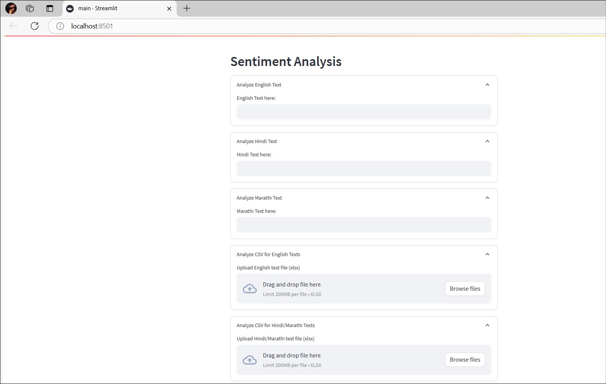
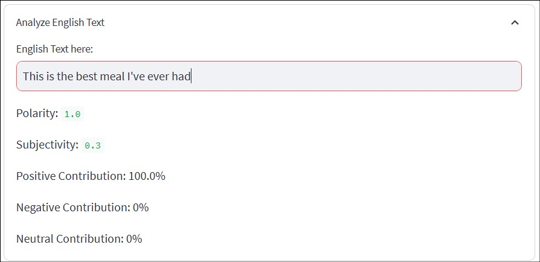
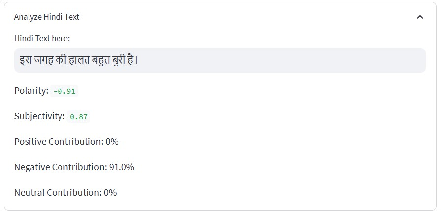
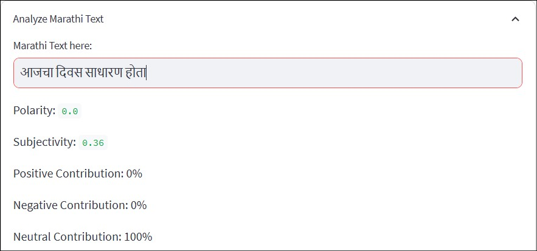
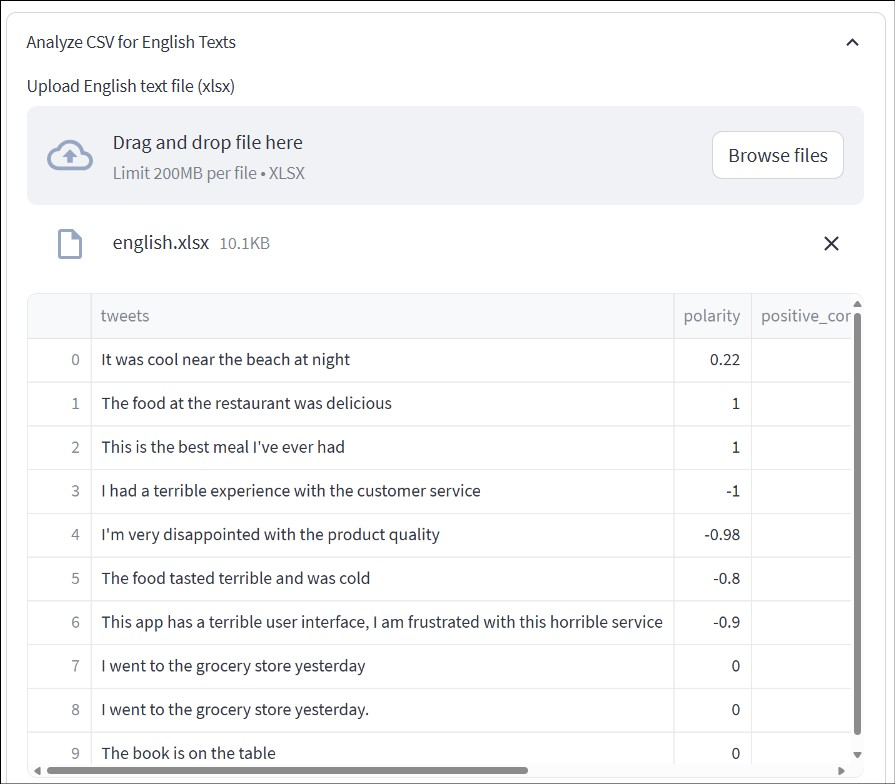
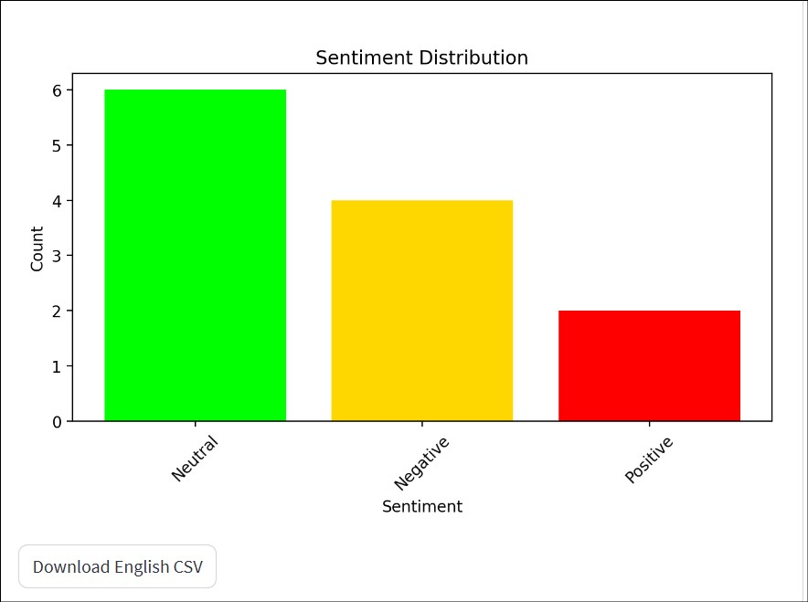
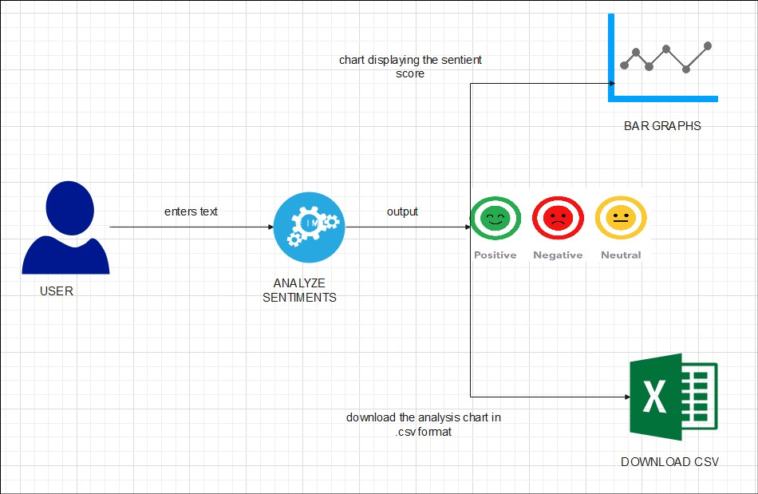
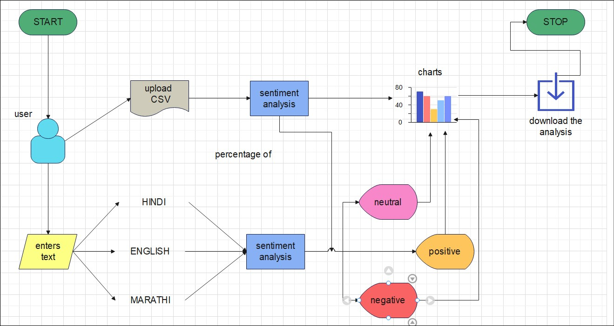
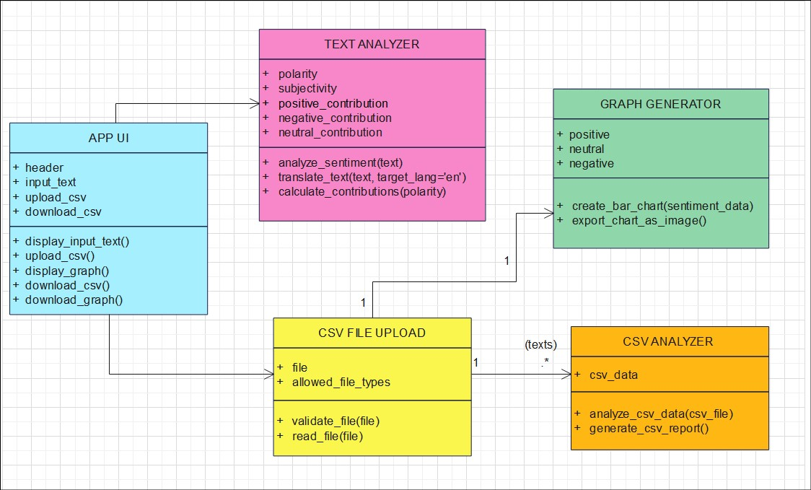

# Text_Sentiment_Analysis
The primary objective of this project is to perform sentiment analysis on user-input text or CSV datasets, focusing on
identifying and categorizing opinions as positive, negative, or neutral. This
project addresses the growing need for efficient sentiment analysis across various
languages (English, Hindi, Marathi) and supports translation for non-English
inputs. </br>
The app processes user inputs, conducts polarity and subjectivity analysis,
and visualizes the results through detailed graphical representations and tabular
data. Additionally, the project offers functionality for CSV file uploads, enabling
the batch analysis of text, and provides downloadable reports. 

</br>

## Technologies Used :
- **Streamlit :** <br/>
Streamlit is an open-source Python framework for building interactive web applications for data science and machine learning. It allows developers to create user-friendly apps quickly, using simple Python scripts without needing extensive front-end knowledge. Its intuitive API helps display charts, tables, and other media directly in the browser, making it ideal for data visualization projects and analytics dashboards.</br>
About [Streamlit](https://docs.streamlit.io/)<br/>
``` pip install streamlit ```
<br/><br/>

- **Pandas :** <br/>
Pandas is a powerful data manipulation library in Python widely used for handling and analyzing structured data. It offers data structures like DataFrames to store, filter, aggregate, and perform complex data transformations efficiently. Pandas is often used in data preprocessing stages, as well as for importing and exporting data to and from various formats, such as CSV and Excel.</br>
About [Pandas](https://pandas.pydata.org/docs/)<br/>
``` pip install pandas ```
<br/><br/>

- **TextBlob :**  <br/>
TextBlob is a natural language processing (NLP) library that simplifies text analysis and language processing tasks, such as sentiment analysis, noun phrase extraction, and translation. It is built on top of NLTK (Natural Language Toolkit) and provides intuitive methods for sentiment scoring and language detection, which are essential for tasks like social media analysis and customer feedback evaluation.</br>
About [TextBlob](https://textblob.readthedocs.io/en/dev/)<br/>
``` pip install textblob ```
<br/><br/>

- **Openpyxl :**  <br/>
penpyxl is a Python library for reading and writing Excel (XLSX) files. It’s particularly useful for projects that require data import/export to Excel, enabling developers to create, modify, and format workbooks and spreadsheets programmatically. Openpyxl is highly efficient for handling Excel data and integrating it into Python-based data pipelines.</br>
About [Openpyxl](https://realpython.com/openpyxl-excel-spreadsheets-python/)<br/>
``` pip install openpyxl ```
<br/><br/>

- **Googletrans :**  <br/>
Googletrans is a Python library that serves as an unofficial API wrapper for Google Translate, allowing developers to integrate translation functionality directly into their applications. It provides easy-to-use methods for translating text between multiple languages, detecting the language of a given text, and accessing translation details like pronunciation and transliteration. Googletrans supports a wide range of languages, making it ideal for multilingual applications or projects that require real-time text translation.</br>
About [Googletrans](https://py-googletrans.readthedocs.io/en/latest/)<br/>
``` pip install googletrans==4.0.0-rc1 ``` 
<br/><br/>

- **Matplotlib :**  <br/>
Matplotlib is a popular Python library for creating static, animated, and interactive visualizations. Known for its versatility and extensive customization options, it allows users to build a wide variety of plots, including bar charts, line plots, histograms, and more. This flexibility makes it essential for data analysis projects where clear and interpretable visualizations are required.</br>
About [Matplotlib](https://matplotlib.org/stable/index.html)<br/>
``` pip install matplotlib ```
</br></br>


## To execute the application : </br>
Navigate to the folder where your app.py is located > open cmd from the directory > streamlit run filename.py 
</br><br/><br/><br/>



<br/>*Application UI*

<br/>


<br/>*English Text*

<br/>


<br/>*Hindi Text*

<br/>


<br/>*Marathi Text*

<br/>


<br/>*English CSV File*

<br/>


<br/>*Analysis Graph*

<br/>


<br/>*System Diagram*

<br/>


<br/>*Flowchart*

<br/>


<br/>*Description of Entities*

<br/>
<br/>
